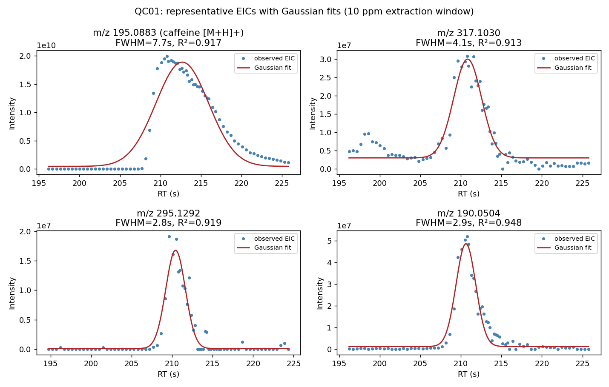

```{r}
Sys.setenv(PYTHONNOUSERSITE='1')# For reticulate/python
library(reticulate)
use_condaenv(
  'baybe',
  conda = Sys.which('conda'),
  required = TRUE
)
```
```{r setup}
knitr::opts_chunk$set(
  message=FALSE, warning=FALSE, 
  fig.align='center',
  cache=TRUE)

library(knitr)
library(kableExtra)

make.kable = function(df, ...) {
  kable(df, ...) |>
    kable_styling(full_width =  TRUE) |>
    scroll_box(width = '100%', height = '300px')
}
```

## Introduction
In the last study, I used `xcms` to pre-process LC/MS data from a MetaboLights
study on tea. Peak picking parameters were manually optimized by trial and
error.  One of the roadblocks in metabolomics is the ability to optimize these
parameters. In 2015, Gunnar Libiseller released a tool called `IPO`, or 
Isotopologue Parameter Optimization, which uses design of experiments (DOE) and
response surface modeling with isotope patterns to determine good peaks and
optimize parameters.[@libiseller2015]  However, others found that this method falls short
compared to manual selection combined with deep knowledge of how LC/MS works.[@kumler2023picky]
The github repository also hasn't been updated in 4 years, although updates to
the vignette still appear, with the last one published on April 28, 2026 as of
this writing. It's officially unsupported. Additionally, the package still uses
the old `XcmsSet` interface versus the `XcmsExperiment` interface introduced
with the last `xcms` updates.

I recently discovered a python package called
[`BayBE`](https://github.com/emdgroup/baybe), or Bayesian Back End, which is
an iterative optimization tool that supposedly thrives in no-data or low-data
environments and finds optima faster than DOE. I brought this up with a
stats colleague and they were very upset that I would dare dunk on DOE, so
now I'm curious how it would fare against `IPO` and manual optimization.

In this study, I'll be using the same tea data from the 
[previous study](https://motoanalytical.com/posts/white-tea), 
which is a time course of white tea samples over 11 years of storage. You
may follow that guide up to the peak picking section to acquire the LC/MS data.
The researchers provided 4 QC samples, which I'll be using to test parameter
optimization. The goal of optimization is to maximize the number of real peaks
detected and minimize the number of false positives, i.e. noise, in the least
amount of optimization time.

Here's the [link to the GitHub repository](https://github.com/jmorim/baybe_xcms),
and you can [download the conda environment.yml here](https://raw.githubusercontent.com/jmorim/baybe_xcms/refs/heads/master/environment.yml). 
If you have problems, feel free to reach out at
[morimoto@motoanalytical.com](mailto:morimoto@motoanalytical.com).

## Libraries
```{r, message=FALSE}
library(xcms)
library(MsExperiment)
library(IPO)
library(dplyr)
library(stringr)
library(BiocParallel)
library(LCMStools)
library(purrr)
library(furrr)
library(ggplot2)
library(colorspace)

if(.Platform$OS == 'Windows'){
  register(bpstart(SnowParam(4, progressbar=FALSE)))
} else if(.Platform$OS == 'unix'){
  register(bpstart(MulticoreParam(4, progressbar=FALSE)))
}
```

For `httpgd` with VSCode and arf

```{r, eval=FALSE}
library(httpgd)
hgd()
hgd_browse()
```

## Loading the study data

We're only going to load the positive QC files from the study. These were
prepared by pooling equivalent volumes of each timepoint sample and running
LC/MS.

```{r}
qc.files = dir('./_mzML', pattern = 'POS_Hh12LWL_QC', full.names = TRUE)
```

## IPO functions and migration
I set up a GitHub Copilot agent to migrate IPO to use the `XcmsExperiment`
interface.  The results from running the optimization with the update were the
same as the original.

The functions to calculate peak picking score (PPS) are needed for the BayBE
optimization, and are provided below, or available in my fork at
[jmorim/IPO](https://github.com/jmorim/IPO).

```{r echo=FALSE, results='asis'}
cat('<details><summary>Show code</summary>\n\n')
```
```{r}
calcPPS.exp <- function(xset, isotopeIdentification=c("IPO", "CAMERA"), ...) {
    
    isotopeIdentification <- match.arg(isotopeIdentification)
    
    ret <- vector(mode="numeric", 5) #array(0, dim=c(1,5)) 
    names(ret) <- c("ExpId", "#peaks", "#NonRP", "#RP", "PPS")
    if(is.null(xset)) {
      return(ret)
    } 
    
    if(nrow(peaks_IPO.exp(xset)) == 0) {
      return(ret)
    }
    
    peak_source <- peaks_IPO.exp(xset)[,c("mz", "rt", "sample", "into", "mzmin", 
                                 "mzmax", "rtmin", "rtmax"),drop=FALSE]
    ret[2] <- nrow(peak_source)
    
    if(isotopeIdentification == "IPO")
      iso_mat <- findIsotopes.IPO.exp(xset, ...)  
    else
      iso_mat <- findIsotopes.CAMERA(xset, ...)
    
    samples <- unique(peak_source[,"sample"])
    isotope_abundance = 0.01108    
    
    #calculating low intensity peaks
    for(sample in samples) {
      non_isos_peaks <- peak_source
      
      if(nrow(iso_mat) > 0) {
        non_isos_peaks <- peak_source[-unique(c(iso_mat)),,drop=FALSE] 
      } 
	  
      speaks <- non_isos_peaks[non_isos_peaks[,"sample"]==sample,,drop=FALSE]
      intensities <- speaks[,"into"]
	    na_int <- is.na(intensities)
	    intensities <- intensities[!na_int]
      
	    if(length(intensities)>0) {
        tmp <- intensities[order(intensities)]
        int_cutoff <- mean(tmp[1:max(round((length(tmp)/33),0),1)])
      
        masses <- speaks[!na_int, "mz"]
        #floor((masses-2*CH3)/CH2) + 2
        maximum_carbon <- calcMaximumCarbon(masses)
        carbon_probabilty <- maximum_carbon*isotope_abundance
      
        iso_int <- intensities * carbon_probabilty
      
        not_loq_peaks <- sum(iso_int>int_cutoff)
        ret[3] <- ret[3] + not_loq_peaks
      }
    }#end_for_sample    
    
    ret[4] <- length(unique(c(iso_mat)))
    if(ret[3] == 0) {
      ret[5] <- (ret[4]+1)^2/(ret[3]+1)  
    } else {    
      ret[5] <- ret[4]^2/ret[3]  
    }
    
    return(ret)
    
  }

peaks_IPO.exp <- function(xset) {
  if (inherits(xset, "xcmsSet")) {
    # peaks function, to work with older xcms-version (<2.99.7)
    # sample column is missing, if first the first sample processed has no peaks
    # see https://github.com/sneumann/xcms/issues/220
    peaks_act <- xcms::peaks(xset)
    if (!("sample" %in% colnames(peaks_act))) {
      colnames(peaks_act)[colnames(peaks_act) == ""] <- "sample"
    }
    return(peaks_act)
  }

  # XcmsExperiment/XCMSnExp (xcms >= 3): the 'sample' column is always
  # present in chromPeaks()
  xcms::chromPeaks(xset)
}

findIsotopes.IPO.exp <- 
  function(xset, checkPeakShape=c("none", "borderIntensity", "sinusCurve", 
                                  "normalDistr")) {
    
    checkPeakShape <- match.arg(checkPeakShape)
    
    iso_mat <- matrix(0, nrow=0, ncol=2)
    if(is.null(xset)) {
      return(iso_mat)
    }
    
    colnames(iso_mat) <- c("12C", "13C")
    peak_source <- peaks_IPO.exp(xset)[,c("mz", "rt", "sample", "into", "maxo", "mzmin",
                                 "mzmax", "rtmin", "rtmax"), drop=FALSE]
    
    for(i in 1:ncol(peak_source)) {
      peak_source <- peak_source[!is.na(peak_source[,i]),,drop=FALSE]
    }
    
    peak_source <- cbind(1:nrow(peak_source), peak_source)
    colnames(peak_source)[1] <- "id"  
    
    #carbon = 12.0
    #hydrogen	= 1.0078250170
    #CH3 = carbon + 3 * hydrogen
    #CH2 = carbon + 2 * hydrogen
    isotope_mass = 1.0033548
    isotope_abundance = 0.01108
    
    samples <- max(peak_source[,"sample"])
    
    #start_sample
    for(sample in 1:samples) { 
      #only looking into peaks from current sample   
      speaks <- peak_source[peak_source[,"sample"]==sample,,drop=FALSE]
      split <- 250
	  if(!(checkPeakShape=="none"))
        rawdata <- loadRaw(xcmsSource(fileNames_IPO(xset)[sample]))
      
      if(nrow(speaks)>1) {  		      
        #speaks <- speaks[,-c("sample")]
        speaks <- speaks[order(speaks[,"mz"]),]
        
        while(!is.null(nrow(speaks)) & length(speaks) > 3) {
          part_peaks <- NULL
          #splitting the data into smaller pieces to improve speed    
          if(nrow(speaks) < split) {
            part_peaks <- speaks
          } else {          
            upper_bound <- speaks[split,"mzmax"] + isotope_mass          
            end_point <- sum(speaks[,"mz"] < upper_bound)
            part_peaks <- speaks[1:end_point,,drop=FALSE]
          }		
          
          rt <- part_peaks[,"rt"]
          rt_window <- rt * 0.005
          rt_lower <- part_peaks[,"rt"] - rt_window
          rt_upper <- part_peaks[,"rt"] + rt_window
          rt_matrix <-  
            t(matrix(rep(rt, nrow(part_peaks)), ncol=nrow(part_peaks)))
          rt_matrix_bool <- rt_matrix >= rt_lower & rt_matrix <= rt_upper
          
          mz <- part_peaks[,"mz"]
          #isotope_masses - mz_window
          mz_lower <- part_peaks[,"mzmin"] + isotope_mass
          #isotope_masses + mz_window
          mz_upper <- part_peaks[,"mzmax"] + isotope_mass
          mz_matrix <-  
            t(matrix(rep(mz, nrow(part_peaks)), ncol=nrow(part_peaks)))
          mz_matrix_bool <- mz_matrix >= mz_lower & mz_matrix <= mz_upper
          
          rt_mz_matrix_bool <- rt_matrix_bool & mz_matrix_bool
          
          rt_mz_peak_ids <- which(rowSums(rt_mz_matrix_bool)>0)
          calculations <- min(split, nrow(speaks))
          rt_mz_peak_ids <- rt_mz_peak_ids[rt_mz_peak_ids < calculations]
          
          for(i in rt_mz_peak_ids) {
            current <- part_peaks[i, ,drop=FALSE]
            rt_mz_peaks <- part_peaks[rt_mz_matrix_bool[i,],,drop=FALSE]
            rt_difference <- 
              abs(current[,"rt"] - rt_mz_peaks[, "rt"]) / current[,"rt"]
            rt_mz_peaks <- cbind(rt_mz_peaks, rt_difference)
            #test intensity_window
            #floor((current["mz"]-2*CH3)/CH2) + 2
            maximum_carbon <- calcMaximumCarbon(current[,"mz"]) 
            carbon_probabilty <- c(1,maximum_carbon)*isotope_abundance
            iso_intensity <- current[,"into"] * carbon_probabilty
            
            int_bools <- 
              rt_mz_peaks[,"into"] >= iso_intensity[1] & 
              rt_mz_peaks[,"into"] <= iso_intensity[2]
            
            if(sum(int_bools) > 0) {
              int_peaks <- rt_mz_peaks[int_bools,,drop=FALSE]
              boundary_bool <- rep(TRUE, (nrow(int_peaks)+1))
              if(!(checkPeakShape=="none")) {
                if(checkPeakShape=="borderIntensity") {
                  boundary_bool <- checkIntensitiesAtRtBoundaries(
                    rawdata, 
                    rbind(current,int_peaks[,-ncol(int_peaks), drop=FALSE]))
                } else {
                  if(checkPeakShape=="sinusCurve") {                
                    boundary_bool <- checkSinusDistribution(
                      rawdata, 
                      rbind(current,int_peaks[,-ncol(int_peaks),drop=FALSE]))
                  } else {                  
                    boundary_bool <- checkNormalDistribution(
                      rawdata, 
                      rbind(current,int_peaks[,-ncol(int_peaks),drop=FALSE]))
                  }
                }
              } #else {
                #boundary_bool <- rep(TRUE, (nrow(int_peaks)+1))
              #}              
              if(boundary_bool[1] & sum(boundary_bool[-1])>0) {                 
                iso_peaks <- int_peaks[boundary_bool[-1],,drop=FALSE]
                iso_id <- 
                  iso_peaks[which.min(iso_peaks[,"rt_difference"]), "id"]
                #iso_list[[length(iso_list)+1]] <- c(current[,"id"], iso_id)            
                iso_mat <- rbind(iso_mat, c(current[,"id"], iso_id))                
              }
            }
          }
          speaks <- speaks[-(1:calculations),]		    
          
        }#end_while_sample_peaks 
      }
    }
    return(iso_mat)
  }

calcMaximumCarbon <- 
  function(masses) {  
    
    carbon = 12.0
    hydrogen  = 1.0078250170
    CH3 = carbon + 3 * hydrogen
    CH2 = carbon + 2 * hydrogen  
    
    maximum_carbon <- floor((masses-2*CH3)/CH2) + 2

    return(maximum_carbon)
  } 
```
```{r echo=FALSE, results='asis'}
cat('</details>\n\n')
```

## IPO optimization

This will follow the [IPO vignette](https://bioconductor.posit.co/packages/release/bioc/vignettes/IPO/inst/doc/IPO.html)
closely. We'll use the default `centWave` parameters to start.

```{r, eval=FALSE}
pp.param = getDefaultXcmsSetStartingParams('centWave')
pp.param$ppm = c(1, 20)
pp.param$min_peakwidth = c(1, 10)
pp.param$max_peakwidth = c(10, 60)
pp.param$mzdiff = c(-0.001, 0.005)

dir.create('ipo', showWarnings = FALSE)
time.xcmsSet = system.time({
  pp.results = optimizeXcmsSet(qc.files[1:2], params = pp.param, subdir = 'ipo')
})
```

Every time I try to run this it crashes. Looking at 
[this issue on github](https://github.com/rietho/IPO/issues/73), there are 
likely issues with how plots are saved when given the `subdir` argument.

```{r}
pp.param = getDefaultXcmsSetStartingParams('centWave')
pp.param$ppm = c(1, 20)
pp.param$min_peakwidth = c(1, 10)
pp.param$max_peakwidth = c(10, 60)
pp.param$mzdiff = c(-0.001, 0.005)
BiocParallel::register(BiocParallel::SerialParam())
time.xcmsSet = system.time({
  pp.results = optimizeXcmsSet(
    qc.files[1:2], params = pp.param, subdir = NULL, plot = TRUE, nSlaves = 4)
})
time.xcmsSet
pp.results$best_settings$parameters
dir.create('_rds', showWarnings = FALSE)
saveRDS(pp.results, '_rds/ipo_results.rds')

if(.Platform$OS == 'Windows'){
  register(bpstart(SnowParam(4, progressbar=FALSE)))
} else if(.Platform$OS == 'unix'){
  register(bpstart(MulticoreParam(4, progressbar=FALSE)))
}
```

## IPO results
The optimization took about 15 minutes. What stands out to me is that the optimum
max peakwidth was 60 seconds, which sounds very high. The biggest peak,
caffeine, had a full peakwidth of about 16 seconds. Other than that,
the parameters landed very close to my manual optimization, 
`ppm=10, peakwidth=c(5,20)`. It also changed the `mzdiff` from the default -0.001
(allowing overlap) to 0.005. I'm not sure what the purpose of the `mzdiff`
parameter is since we already have a `ppm` parameter discriminating on the
_m/z_ domain. From the documentation, it's the minimum difference in _m/z_ for
peaks that coelute to be considered different. My impression as an MS expert is 
it's redundant.

It's worth noting that the models predicted a peak picking score (PPS) of over
4500 in the first batch, but didn't reach that in the second round of
optimization. The results for the "best settings" returned those that yielded
a PPS of 4034, but the first round of optimization already had a maximum PPS
of 4158 with the settings `ppm = 10.5, peakwidth = c(5.5, 35), mzdiff = 0.005`,
another issue with the package. We'll use the actual best settings going forward.

I'd like to see what caffeine looks like with the optimal parameters.

```{r}
cwp.ipo = CentWaveParam(
  ppm = 10.5,
  peakwidth = c(5.5, 35),
  mzdiff = 0.005
)

qc.data = readMsExperiment(qc.files)
peaks.qc = findChromPeaks(qc.data, param = cwp.ipo)

caffeine.mzr = calcPPM(195.0877, cwp.ipo@ppm)
peaks.qc |> 
  filterMz(c(caffeine.mzr[1], caffeine.mzr[2])) |>
  chromatogram() |>
  plot()
```

This looks reasonable. Anecdotally, I've had IPO settle on parameters that
resulted in peak splitting, but this seems to have worked well.

## BayBE optimization
To make a fair comparison to BayBE, we need to consider what IPO was optimizing.
The response surfaces map how PPS changes with the peak picking parameters. PPS
is calculated with
$$
PPS = \frac{RP^2}{'all peaks' - LIP}
$$
where RP is the number of reliable peaks and LIP is the number of low intensity
peaks. RP is determined by the number of peaks matching an isotopologue pattern
determined by the maximum possible carbons and the 1.1% 13C natural abundance.
If a peak falls short of the expected intensity of the isotopologue, it's 
labeled LIP so the score isn't penalized. The max score from this optimization
experiment was 4034, with 21,728 total peaks and 6658 RPs.

The problem with this scoring metric is that it's blind to bad peak
integrations.  Two isomeric peaks close together could be integrated as one but
would count as a reliable peak due to the consistent isotopologue pattern.
Conversely, one single peak could be integrated as multiple peaks, as we've seen
above. Since a higher number of peaks is rewarded, the scoring algorithm favors
splitting peaks.

More troubling, I found that the scoring function, `ret[5] <- ret[4]^2/ret[3]`,
or `RP^2 / sum(NonRP)`, doesn't match what they published in the paper. The
implemented code is dividing by the total number of non-reliable peaks, not the
total number of peaks. I don't know if they changed this after publishing, but I
couldn't find a history of changes in the repo.

Now, let's get BayBE set up and let it give some starting parameters so
we know what to do with the output.

Caution: I'm new to `reticulate` and ran into some issues with the ecosystem in
terms of `torch` and what my GPU is and what drivers I have. I had to do
some tinkering to get it to use CPU only. This shouldn't require heavy lifting
since `torch` is just recommending some numbers.

```{r}
baybe = import('baybe')
torch = import('torch')
baybe.parameters = import('baybe.parameters')
baybe.searchspace = import('baybe.searchspace')
baybe.targets = import('baybe.targets')
baybe.objectives = import('baybe.objectives')
Campaign = import('baybe.campaign')

# ncp is a class for NumericalContinuousParameter
NCP = baybe.parameters$NumericalContinuousParameter

# Ideally, the bounds would match the starting parameters from IPO, but
# DOE by design probes outside of the bounds and rescopes further iterations
# accordingly. For BayBE, the starting parameters need to be wider since
# it won't look outside of them.
parameters = c(
  NCP(name = 'ppm', bounds = c(1, 20)),
  NCP(name = 'min_peakwidth', bounds = c(1, 10)),
  NCP(name = 'max_peakwidth', bounds = c(10, 60)),
  NCP(name = 'mzdiff', bounds = c(-0.001, 0.005))
)

searchspace = baybe.searchspace$SearchSpace$from_product(parameters)
target = baybe.targets$NumericalTarget(name='PPS')
objective = baybe.objectives$SingleTargetObjective(target=target)

campaign = Campaign$Campaign(
  searchspace = searchspace,
  objective = objective
)

# Indentation matters here
set_all_seeds = function(seed) {
  reticulate::py_run_string(sprintf("
import random, numpy, torch
random.seed(%d)
numpy.random.seed(%d)
torch.manual_seed(%d)
", seed, seed, seed))
}

set_all_seeds(17)
recommendations = campaign$recommend(batch_size = 4L) # Match number of workers
knitr::kable(recommendations) |>
  kable_styling(full_width = TRUE) |>
  scroll_box(width = "100%", height = "300px")

qc.data = readMsExperiment(qc.files[1:2])
plan(multisession, workers = 4)
time.baybe.0 = system.time({
  pps.scores = future_map(seq_len(nrow(recommendations)), ~ {
  calcPPS.exp(
    xset = findChromPeaks(qc.data,
    param = CentWaveParam(
      ppm = recommendations[.x, 'ppm'],
      peakwidth = c(recommendations[.x, 'min_peakwidth'], recommendations[.x, 'max_peakwidth']),
      mzdiff = recommendations[.x, 'mzdiff']
    ))
  )
}, .options = furrr_options(seed = TRUE))
})
plan(sequential)

pps.scores.table = pps.scores |> bind_rows()
knitr::kable(pps.scores.table) |>
  kable_styling(full_width = TRUE) |>
  scroll_box(width = "100%", height = "300px")
```

In the first round of experiments, BayBE uses farthest point sampling
recommendations. The best PPS score from IPO was 4158, while the best score here
is 4071, from
`ppm=11.94, peakwidth=c(6.9, 49.3), mzdiff=0.0028`.

Let's run a second round of recommendations, which will use the Botorch
optimizer to find the next best parameters.

```{r}
measurements.0 = recommendations |>
  bind_cols(pps.scores.table)

campaign$add_measurements(measurements.0)
recommendations.1 = campaign$recommend(batch_size = 4L)
knitr::kable(recommendations.1) |> 
  kable_styling(full_width = TRUE) |>
  scroll_box(width = "100%", height = "300px")

set_all_seeds(17)
plan(multisession, workers = 4)
time.baybe.1 = system.time({
  pps.scores.1 = future_map(seq_len(nrow(recommendations.1)), ~ {
  calcPPS.exp(
    xset = findChromPeaks(qc.data,
    param = CentWaveParam(
      ppm = recommendations.1[.x, 'ppm'],
      peakwidth = c(recommendations.1[.x, 'min_peakwidth'], recommendations.1[.x, 'max_peakwidth']),
      mzdiff = recommendations.1[.x, 'mzdiff']
    ))
  )
}, .options = furrr_options(seed = TRUE))
})
plan(sequential)

pps.scores.table.1 = pps.scores.1 |> bind_rows()
knitr::kable(pps.scores.table.1) |>
  kable_styling(full_width = TRUE) |>
  scroll_box(width = "100%", height = "300px")

measurements.1 = recommendations.1 |> bind_cols(pps.scores.table.1)

campaign$add_measurements(measurements.1)
```

The first two rounds took about a minute each, and peak picking score increased
to 4103. But how do we know when we're done?

## Automatic iterative optimization with BayBE
BayBE is meant to be an iterative process, typically used at the bench, for
example, to optimize a product yield from a reaction. Since we're dealing with
code, we can run this in a loop until the optimization converges. We need to
define criteria for convergence based on the maximum number of iterations,
what's big enough of an improvement to be considered a new optimum, and
how many iterations to run before optimization is considered converged. These
are defined in the `max.iterations`, `patience`, and `tolerance` variables
below.

```{r}
run.iteration = function(campaign, qc.data, batch_size = 4L) {
  set_all_seeds(17)
  recs = campaign$recommend(batch_size = batch_size)

  pps.scores = future_map(seq_len(nrow(recs)), ~ {
    calcPPS.exp(
      xset = findChromPeaks(qc.data,
      param = CentWaveParam(
        ppm = recs[.x, 'ppm'],
        peakwidth = c(recs[.x, 'min_peakwidth'], recs[.x, 'max_peakwidth']),
        mzdiff = recs[.x, 'mzdiff']
      ))
    )
  }, .options = furrr_options(seed=TRUE)) |> bind_rows()

  measurements = recs |> bind_cols(pps.scores)
  campaign$add_measurements(measurements)

  list(recommendations = recs, scores = pps.scores, measurements = measurements)
}

max.iterations = 99
patience = 11 # Setting this so total iterations is comparable to IPO
tolerance = 1

best.pps = max(campaign$measurements$PPS)
no.improvement.cnt = 0

plan(multisession, workers = 4)
time.baybe.2 = system.time({
  for (i in seq_len(max.iterations)) {
    result = run.iteration(campaign, qc.data)
#    history[[i]] = result
    current.best = max(result$measurements$PPS, na.rm = TRUE)
    cat(sprintf('Iteration %d - best PPS this round: %.4f (running best: %.4f)\n',
    i, current.best, max(best.pps, current.best)))
    if (current.best > best.pps + tolerance) {
      best.pps = current.best
      no.improvement.cnt = 0
    } else {
      no.improvement.cnt = no.improvement.cnt + 1
    }

    if (no.improvement.cnt >= patience) {
      cat(sprintf('Converged after %d iterations, no improvement > %.4f for %d rounds.\n',
      i, tolerance, patience))
      break
    }
  }
})
plan(sequential)
```

This took about 75 minutes to run, and after 200 additional experiments, the
optimization converged with a best PPS of 4176, about the same as IPO. The
best determined settings were `ppm = 9.65, peakwidth = c(5.55, 34.82), mzdiff = 0.0037`.

Again, caffeine will be plotted to see how the peaks look with these parameters.

```{r}
make.kable(campaign$measurements)

# Best settings from BayBE
pp.baybe = campaign$measurements |>
  filter(PPS == max(PPS)) |>
  select(ppm, min_peakwidth, max_peakwidth, mzdiff, PPS)

cwp.baybe = CentWaveParam(
  ppm = pp.baybe$ppm,
  peakwidth = c(
    pp.baybe$min_peakwidth,
    pp.baybe$max_peakwidth
  ),
  mzdiff = pp.baybe$mzdiff
)

peaks.baybe = findChromPeaks(qc.data, param = cwp.baybe)

caffeine.mzr = calcPPM(195.0877, pp.baybe$ppm)
peaks.baybe |> 
  filterMz(c(caffeine.mzr[1], caffeine.mzr[2])) |>
  chromatogram() |> 
  plot()
```

These results look pretty close to what IPO and my manual optimization ended up with.

## Manual optimization
This is repeated from the last post on the white tea.

```{r}
pos.data = readMsExperiment(qc.files)

cwp = CentWaveParam(
  ppm = 6,
  peakwidth = c(10, 30)
)

peaks.manual = findChromPeaks(qc.data, param = cwp)
calcPPS.exp(peaks.manual)
peaks.manual |> 
  filterMz(c(caffeine.mzr[1], caffeine.mzr[2])) |>
  chromatogram() |> 
  plot()
```

Even though PPS is 2365, I still like mine more because more of the peak is
integrated than the others.

## LLM optimization
I was curious if and how a large language model (LLM) could optimize these
parameters. I fed the raw QC data to Claude with the free Sonnet 5 model at
medium effort and told it to generate peak picking parameters for `centWave`
until it produced good peaks resembling Gaussian shapes.



It couldn't run `xcms` in its sandbox, but output suggested parameters:
```{r}
cwp.claude = CentWaveParam(
  ppm = 5,
  peakwidth = c(2, 20),
  snthresh = 6,
  noise = 5000,
  prefilter = c(3, 1000),
  mzdiff = -0.001,
  fitgauss = TRUE
)

peaks.claude = findChromPeaks(qc.data, param = cwp.claude)

peaks.claude |> 
  filterMz(c(caffeine.mzr[1], caffeine.mzr[2])) |>
  chromatogram() |> 
  plot()

calcPPS.exp(peaks.claude)
```

This looks reasonable, but the PPS score is only 1062, the worst of the
methods, suggesting many false negatives. However, Claude wasn't optimizing for
PPS, but rather good peak shapes, and it used a correlation coefficient 
to compare peaks to a Gaussian shape. Perhaps in another post, we can 
compare optimization methods using the scoring metric from the Kumler paper,
which also uses a correlation coefficient to Gaussian shapes to determine
peak quality.[@kumler2023picky]

## Comparing results
Let's compare IPO and BayBE with a convergence plot to show how the optimization
progressed with each iteration. My manual optimization and the LLM
recommendations will also be included.

```{r}
ipo.table = map_dfr(seq_along(pp.results), ~ {
  tibble(
    method = 'IPO',
    iteration = .x,
    subexp = pp.results[[.x]]$response[,'exp'],
    pps = pp.results[[.x]]$response[,'PPS'],
  )
}) |>
  mutate(
    experiment = row_number(),
    cumulative.best = cummax(pps)
  )

## Last item in list is the result, so remove last row
ipo.table = ipo.table[-nrow(ipo.table), ]

# For BayBE, each iteration is in chunks of 4
convergence.table = map_dfr(seq_len(nrow(campaign$measurements)), ~ {
  tibble(
    method = 'BayBE',
    iteration = ceiling(as.numeric(rownames(campaign$measurements)[.x]) / 4),
    pps = campaign$measurements$PPS[.x],
  )
}) |>
  mutate(
    experiment = row_number(),
    subexp = rep(1:4, length.out = nrow(campaign$measurements)),
    cumulative.best = cummax(pps)) |>
  bind_rows(ipo.table)

convergence.table = convergence.table |>
  bind_rows(tibble(
    method = 'Manual',
    iteration = 3,
    subexp = 1,
    pps = calcPPS.exp(peaks.manual)['PPS'],
    cumulative.best = pps
  ) |> mutate(experiment = row_number(), cumulative.best = cummax(pps)), tibble(
    method = 'LLM',
    iteration = 1,
    pps = calcPPS.exp(peaks.claude)['PPS'],
    cumulative.best = pps
  ) |> mutate(experiment = row_number(), cumulative.best = cummax(pps))) |>
  select(c(method, iteration, experiment, subexp, pps, cumulative.best))

make.kable(convergence.table)

ggplot(convergence.table, 
  aes(x = experiment, y = cumulative.best, color = method)) +
  geom_line() +
  geom_point(aes(y = pps)) +
  labs(
    title = 'IPO vs BayBE Convergence',
    x = 'Iteration',
    y = 'Best PPS found (cumulative)'
  ) +
  theme_classic(base_size = 16) +
  scale_color_discrete_qualitative(palette = 'Dark 3') +
  theme(legend.position = 'bottom')
```

So finally, the order of performance is BayBE > IPO > manual > LLM.  BayBE was
able to find a better optimum than IPO, but took significantly longer, and the
gains were slim. IPO still performed better than manual optimization by its own
metric, PPS.  Claude performed the worst out of the four methods, but used a
conservative peak quality metric, and was only given one iteration. Like
anything with LLMs, it's dangerous to use its outputs without checking for
yourself first.

## IPO migration
The irony and juxtaposition with the above paragraph doesn't escape me, but I
set up a GitHub Copilot agent to update IPO to use the `XcmsExperiment`
interface.  The results from running the optimization with the update were the
same as the original.

```{r, eval=FALSE}
library(devtools)
pak::pak('jmorim/IPO')
library(IPO)

pp.param = IPO::getDefaultXcmsSetStartingParams('centWave')

time.xcmsSet = system.time({
  pp.results = optimizeXcmsSet(qc.files[1:2], params = pp.param, subdir = NULL, plot = TRUE)
})

pp.results
```

## Session Info
```{r}
sessionInfo()
```

## References

_Raw LC-MS data used in this post is from the MetaboLights study MTBLS13336 Shu
Ya Wei and Long Wen Li, available under [CC0 1.0
Universal](https://creativecommons.org/publicdomain/zero/1.0/) at 
https://www.ebi.ac.uk/metabolights/MTBLS13336. MetaboLights: Yurekten et al.,
2023._